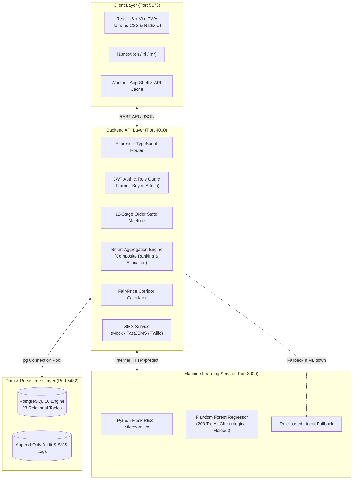

# KisanSetu (किसानसेतू)

> **India's Intelligent Direct Farm-to-Market Network**  
> *Smart India Hackathon (SIH) — AgriTech Innovation*

[](https://www.typescriptlang.org/)
[](https://react.dev/)
[](https://expressjs.com/)
[](https://www.postgresql.org/)
[](https://scikit-learn.org/)
[](https://web.dev/progressive-web-apps/)

---

## 🌾 The Problem

Smallholder farmers in India face three systemic market disadvantages:
1. **Asymmetric Price Information**: Intermediaries control mandi spot rates, forcing distress sales at harvest peaks.
2. **Minimum Volume Barriers**: Institutional buyers (retail chains, hotel consortia, food processors) require multi-ton uniform shipments that no single smallholder can supply independently.
3. **Payment Counterparty Risk**: Farmers wait weeks or months for informal credit settlement, with zero legal or escrow protection.

## 🚀 The KisanSetu Solution

KisanSetu bridges smallholder farmers and institutional buyers through an integrated, data-driven platform:
- **Demand Forecasting Engine**: Machine learning predictions trained on historical crop arrivals and regional consumption patterns to advise farmers *before* harvesting.
- **Fair-Price Intelligence**: Real-time mandi price tracking combined with regional averages and quality adjustments to create dynamic, transparent fair-price corridors.
- **Smart Aggregation Engine**: KisanSetu's algorithmic centerpiece that clusters nearby smallholder listings and builds optimal bulk batches meeting wholesale specifications.
- **Demo Escrow & Settlement**: Milestone-based funds custody where buyer capital is locked at confirmation and automatically split to farmers upon verified delivery.
- **Low-Connectivity Fallback**: Full SMS event notification pipeline ensuring farmers without smartphones or 4G data remain informed at every milestone.
- **Multilingual Progressive Web App**: Fully localized in English, Hindi (हिंदी), and Marathi (मराठी) with offline app-shell caching.

---

## 🏛️ System Architecture



---

## 📦 Core Capabilities

| Capability | Description | Documentation |
|---|---|---|
| **Smart Aggregation** | Multi-objective optimization ($0.35$ distance, $0.30$ price, $0.20$ quantity, $0.15$ rating) clustering smallholder supply into bulk orders with exact paisa payout reconciliation. | [docs/aggregation.md](docs/aggregation.md) |
| **Demand Forecasting** | scikit-learn `RandomForestRegressor` with calendar, lag, and rolling features, achieving $30.3\%$ MAE improvement over moving-average baseline. | [docs/demand-forecasting.md](docs/demand-forecasting.md) |
| **Price Intelligence** | Dynamic corridor suggestion blending spot mandi prices, regional averages, 30-day baselines, quality grade, and demand momentum. | [docs/price-intelligence.md](docs/price-intelligence.md) |
| **12-Stage Order Machine** | Deterministic state flow (`listed` → `offer_received` → `confirmed` → `payment_held` → `batch_formed` → `in_transit` → `delivered` → `settled`). | [docs/architecture.md](docs/architecture.md) |
| **SMS Notification Pipeline** | Universal event alerting for pickups, offers, delivery, and escrow releases with zero external dependency via built-in mock mode. | [docs/sms.md](docs/sms.md) |
| **23-Table Relational Schema** | Normalized PostgreSQL schema with foreign-key cascade integrity, composite lookup indices, and tamper-evident audit logs. | [docs/database.md](docs/database.md) |

---

## ⚡ Quick Start Guide

### 1. Prerequisites
- **Node.js**: v18.0.0+ (Tested on v24.19.0 LTS)
- **PostgreSQL**: 14+ (Tested on PostgreSQL 16)
- **Python**: 3.10+ (Tested on Python 3.13)
- **Git**

### 2. Clone and Install Dependencies
```bash
git clone https://github.com/your-repo/kisansetu.git
cd kisansetu

# Install monorepo dependencies (root, client, server, shared)
npm install
```

### 3. Setup PostgreSQL Database
Ensure your PostgreSQL server is running on `localhost:5432`.
```bash
# Create database
psql -U postgres -c "CREATE DATABASE kisansetu;"

# Configure environment files
cp .env.example .env
cp .env.example server/.env
# Verify DATABASE_URL=postgres://postgres:<password>@localhost:5432/kisansetu in both files
```

### 4. Build Shared Types, Migrate & Seed
```bash
# 1. Build TypeScript DTO & Enum package
npm run build:shared

# 2. Apply all 23 database tables
npm run migrate

# 3. Seed initial 23 users, 30 listings, 10 orders, and 9,000 historical price/demand records
npm run seed
```

### 5. Setup & Train Machine Learning Service
```bash
cd ml

# Create and activate Python virtual environment
python -m venv .venv
# Windows:
.venv\Scripts\activate
# Linux/macOS:
source .venv/bin/activate

# Install requirements
pip install -r requirements.txt

# Train demand forecasting model (generates ml/models/demand_forecast_rf.joblib)
python training/train_forecast.py

# Launch ML prediction microservice (runs on port 8000)
python services/api.py
```

### 6. Launch Backend & Frontend Servers
In two separate terminals:
```bash
# Terminal 1: Launch Express API (port 4000)
npm run dev:server

# Terminal 2: Launch Vite React Client (port 5173)
npm run dev:client
```

Open your browser at **`http://localhost:5173`**.

---

## 🔑 Demo Accounts & Credentials

All seeded accounts share the default password: **`Demo@123`**

| Role | Email | Password | Primary Capabilities |
|---|---|---|---|
| **Farmer** | `farmer@kisansetu.demo` | `Demo@123` | List produce, view demand forecast, inspect fair-price corridor, review offers, track pickups & payments |
| **Buyer** | `buyer@kisansetu.demo` | `Demo@123` | Search marketplace, run Smart Aggregation (`Find Supply`), negotiate offers, fund escrow, schedule logistics, confirm delivery |
| **Admin** | `admin@kisansetu.demo` | `Demo@123` | Platform GMV metrics, intelligence center, SMS dispatch logs, security audit logs |

---

## 🎯 Automated SIH Demo Mode

To observe or present the entire KisanSetu product lifecycle in an automated walkthrough:
1. Navigate to **`http://localhost:5173/demo-mode`**.
2. Click **"Run Full Demo"**.
3. Watch KisanSetu execute all 12 stages live against the real backend, PostgreSQL database, and ML service:
   `FORECAST` → `INFORM` → `LIST` → `DISCOVER` → `AGGREGATE` → `NEGOTIATE` → `ORDER` → `LOGISTICS` → `ESCROW` → `DELIVER` → `SETTLE` → `LEARN`.

For a timed judge presentation pitch, refer to the [3-Minute Hackathon Demo Script](docs/demo-script.md).

---

## 📂 Project Structure

```
kisansetu/
├── client/                     # Frontend Application (React 18 + Vite + Tailwind)
│   ├── public/                 # Static assets, PWA icons, offline.html fallback
│   ├── src/
│   │   ├── components/         # Design system UI primitives & layout shells
│   │   ├── hooks/              # Auth & session context hooks
│   │   ├── i18n/               # English, Hindi, Marathi localization bundles
│   │   ├── lib/                # Typed API client & SIH demo orchestrator
│   │   └── pages/              # Farmer, Buyer, Admin, and Public views
│   └── vite.config.ts          # Vite configuration with PWA plugin & API proxy
├── server/                     # Backend API (Node.js + Express + TypeScript)
│   ├── src/
│   │   ├── config/             # Environment validation & database pool setup
│   │   ├── controllers/        # Route controllers
│   │   ├── db/
│   │   │   ├── migrations/     # 001_init.sql (23 relational tables)
│   │   │   └── seed/           # Seed migration loader & seed.sql dataset
│   │   ├── repositories/       # Typed PostgreSQL SQL query layer
│   │   ├── routes/             # REST endpoint route registrations
│   │   ├── services/           # Business logic & domain algorithms
│   │   │   └── algorithms/     # Aggregation, fair-pricing, and fallback engines
│   │   └── utils/              # Haversine distance, password hashing, JWT
├── shared/                     # @kisansetu/shared (Monorepo TypeScript package)
│   └── src/
│       ├── dtos/               # Request and response data transfer contracts
│       ├── enums/              # Crops, regions, order statuses, roles
│       └── types/              # Domain interfaces shared by client and server
├── ml/                         # Machine Learning Microservice (Python + Flask)
│   ├── data/                   # Historical daily demand & price CSV datasets
│   ├── models/                 # Serialized joblib models & metrics.json
│   ├── services/               # Flask REST API (`api.py`)
│   └── training/               # Feature engineering and model training scripts
├── scripts/                    # Dataset generation utilities (`generate_seed.py`)
└── docs/                       # Technical documentation suite
    ├── architecture.md         # 3-tier architecture, state machines, and security
    ├── aggregation.md          # Smart Aggregation Engine mathematics & clustering
    ├── demand-forecasting.md   # ML pipeline, feature engineering, and metrics
    ├── price-intelligence.md   # Mandi corridors & fair-price algorithm
    ├── sms.md                  # Low-connectivity fallback architecture
    ├── database.md             # 23-table relational schema & indexing strategy
    ├── api.md                  # Complete REST API reference
    └── demo-script.md          # 3-minute hackathon judge presentation script
```

---

## 🛡️ License

This project is licensed under the MIT License — see the `LICENSE` file for details. Built for the **Smart India Hackathon (SIH)**.
