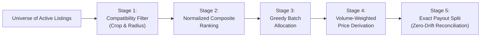

# The Smart Aggregation Engine

> **KisanSetu's Algorithmic Centerpiece**  
> *Transforming Fragmented Smallholder Harvests into Bulk Commercial Consignments*

---

## 1. The Smallholder Aggregation Dilemma

In India, over $86\%$ of farmers operate marginal landholdings under 2 hectares. When an institutional buyer (such as a grocery chain, restaurant network, or food processing unit) requires $5,000\text{ kg}$ of Grade-A tomatoes:
- **Individual Farmer Capacity**: A smallholder typically yields between $300\text{ kg}$ and $1,200\text{ kg}$ per picking.
- **Transaction Friction**: The buyer refuses to negotiate, inspect, and transport 8 separate small consignments independently due to prohibitive administrative and logistical overhead.
- **The Intermediary Trap**: Village middlemen exploit this barrier by purchasing smallholder lots at distress rates ($30\text{--}50\%$ below terminal market value) and aggregating the cargo themselves.

**KisanSetu's Smart Aggregation Engine** algorithmically solves this market failure by clustering proximate smallholders with compatible harvest profiles into a single, cohesive, bulk-ready batch.

---

## 2. Mathematical Formulation

The engine executes in 5 sequential stages, implemented in pure, dependency-free TypeScript in `server/src/services/algorithms/aggregation.algorithm.ts`.

### Stage 1: Spatial & Crop Compatibility Filter

Given a buyer requirement with target crop $C_{\text{req}}$, required quantity $Q_{\text{req}}$, destination coordinates $(\phi_{\text{dest}}, \lambda_{\text{dest}})$, and search radius $R_{\max}$ (default: $250\text{ km}$):

The candidate universe $\mathcal{L}$ is filtered to compatible candidates $\mathcal{L}_{\text{comp}}$:
$$\mathcal{L}_{\text{comp}} = \left\{ l \in \mathcal{L} \;\middle|\; l.\text{crop} = C_{\text{req}} \;\land\; l.Q_{\text{avail}} > 0 \;\land\; d(l, \text{dest}) \le R_{\max} \right\}$$

Where $d(l, \text{dest})$ is computed via the **Haversine Great-Circle Formula**:
$$a = \sin^2\left(\frac{\Delta \phi}{2}\right) + \cos(\phi_1) \cdot \cos(\phi_2) \cdot \sin^2\left(\frac{\Delta \lambda}{2}\right)$$
$$c = 2 \cdot \arctan2\left(\sqrt{a}, \sqrt{1 - a}\right)$$
$$d = 6371 \times c \quad (\text{km})$$

> **Coordinate Resilience**: If a rural farmer lists produce without smartphone GPS permissions, KisanSetu automatically falls back to the geographic centroid of the farmer's registered region (e.g., Nashik: $20.0000^\circ\text{N}, 73.7800^\circ\text{E}$; Pune: $18.5204^\circ\text{N}, 73.8567^\circ\text{E}$).

---

### Stage 2: Normalized Multi-Objective Composite Ranking

To select the highest-quality and most cost-effective contributors, each candidate $l \in \mathcal{L}_{\text{comp}}$ is scored across 4 dimensions:
1. **Distance** ($d$ in km): Proximity reduces transit time and spoilage.
2. **Price** ($p$ in ₹/kg): Competitive offers lower buyer acquisition cost.
3. **Available Volume** ($q$ in kg): Larger lots minimize pickup stops.
4. **Farmer Trust Rating** ($r \in [0, 5]$): Historical quality and punctuality.

Because these metrics possess disparate scales and units, each factor is normalized to $[0, 1]$ relative to the active candidate pool before applying weights:

$$\text{norm}_d = \frac{d_l}{\max(\{d_k\} \cup \{1\})}$$

$$\text{norm}_p = \frac{p_l - \min(\{p_k\})}{\max(\{p_k\}) - \min(\{p_k\}) + \epsilon}$$

$$\text{norm}_q = 1 - \frac{q_l}{\max(\{q_k\} \cup \{1\})}$$

$$\text{norm}_r = 1 - \frac{r_l}{5.0}$$

The final composite score $S_l$ is computed as:
$$S_l = w_d \cdot \text{norm}_d + w_p \cdot \text{norm}_p + w_q \cdot \text{norm}_q + w_r \cdot \text{norm}_r$$

#### Weight Distribution
$$\sum w_i = 1.0 \quad \text{where} \quad w_d = 0.35, \; w_p = 0.30, \; w_q = 0.20, \; w_r = 0.15$$

**Rule**: *Lower composite score indicates a superior candidate*. Candidates are sorted ascending by $S_l$.

---

### Stage 3: Greedy Batch Allocation

The engine iterates through sorted candidates, allocating available kilograms until $Q_{\text{req}}$ is satisfied:

$$\text{Let } Q_{\text{rem}} = Q_{\text{req}}$$
$$\text{For each } l \in \text{sorted}(\mathcal{L}_{\text{comp}}):$$
$$\text{if } Q_{\text{rem}} \le 0 \implies \mathbf{break}$$
$$q_{\text{alloc}} = \min(l.Q_{\text{avail}}, Q_{\text{rem}})$$
$$Q_{\text{rem}} \leftarrow Q_{\text{rem}} - q_{\text{alloc}}$$

Each contribution is rounded to 2 decimal places ($q_{\text{rounded}} = \text{round}_2(q_{\text{alloc}})$) to ensure hardware-level floating-point precision cannot cause sub-gram discrepancies.

---

### Stage 4: Volume-Weighted Price Derivation

The blended price per kilogram presented to the buyer reflects the true volumetric contribution of each participating farmer:

$$P_{\text{weighted}} = \text{round}_2\left( \frac{\sum_{i=1}^M (q_i \cdot p_i)}{\sum_{i=1}^M q_i} \right)$$

Where:
- $M$ is the count of contributing farmers in the batch.
- $q_i$ is the volume contributed by farmer $i$.
- $p_i$ is the agreed per-kg unit price of farmer $i$.

---

### Stage 5: Zero-Drift Financial Payout Reconciliation

A major hazard in multi-party agricultural billing is **rounding drift**: multiplying a rounded average price by total volume often produces a discrepancy of several rupees when compared against the sum of individual farmer invoices.

KisanSetu guarantees **zero financial drift** by deriving all totals directly from the rounded line-item subtotals:

$$\text{Line Subtotal}_i = \text{round}_2(q_i \cdot p_i)$$
$$\text{Estimated Total} = \sum_{i=1}^M \text{Line Subtotal}_i$$
$$\text{Payout}_i = \text{Line Subtotal}_i$$

$$\sum_{i=1}^M \text{Payout}_i \equiv \text{Estimated Total} \quad (\text{Exact to } ₹0.01)$$

When escrow funds are subsequently unlocked upon verified delivery, the settlement engine distributes exactly $\text{Payout}_i$ into each farmer's account ledger.

---

## 3. Real-World Execution Example

Consider a buyer requesting **$3,000\text{ kg}$ of Tomatoes** delivered to Pune ($18.52^\circ\text{N}, 73.85^\circ\text{E}$):

| Farmer | Location | Distance | Stock | Price | Rating | Score | Contribution | Subtotal |
|---|---|---|---|---|---|---|---|---|
| **Ramesh Patil** | Junnar, Pune | $72.4\text{ km}$ | $1,200\text{ kg}$ | ₹$21.50$ | $4.8$ | **0.184** | **$1,200\text{ kg}$** | ₹$25,800.00$ |
| **Suresh More** | Shirur, Pune | $64.1\text{ km}$ | $1,000\text{ kg}$ | ₹$22.00$ | $4.5$ | **0.219** | **$1,000\text{ kg}$** | ₹$22,000.00$ |
| **Anil Shinde** | Niphad, Nashik | $168.2\text{ km}$ | $1,500\text{ kg}$ | ₹$20.00$ | $4.2$ | **0.342** | **$800\text{ kg}$** *(partial)* | ₹$16,000.00$ |
| **Total Batch** | | **$101.6\text{ km}$ avg** | | | | | **$3,000\text{ kg}$** | **₹$63,800.00$** |

### Output Metrics
- **Fulfilled Volume**: $3,000.00\text{ kg}$ ($100\%$ fulfilled, supply gap: $0\text{ kg}$).
- **Volume-Weighted Blended Price**:
  $$P_{\text{weighted}} = \frac{25,800 + 22,000 + 16,000}{3,000} = \frac{63,800}{3,000} \approx ₹21.27\text{/kg}$$
- **Logistical Optimization**: A single 3-ton transport truck executes a 3-stop milk-run route instead of 3 independent trips, saving up to $42\%$ in carbon footprint and freight charges.

---

## 4. Edge Cases Handled

1. **Supply Shortfall ($Q_{\text{avail}} < Q_{\text{req}}$)**:
   The engine allocates all available qualifying supply, sets `fullyFulfilled: false`, and reports the exact `supplyGapKg`. The buyer can confirm the partial batch or expand their search radius.
2. **Identical Scores**:
   Ties are broken deterministically by distance (closest first), followed by alphabetical listing ID.
3. **Dynamic Re-aggregation on Partial Order Cancellation**:
   If a farmer fails pickup verification, the order item is withdrawn and the remaining lot either recalculates its weighted price or invites adjacent candidate listings.
