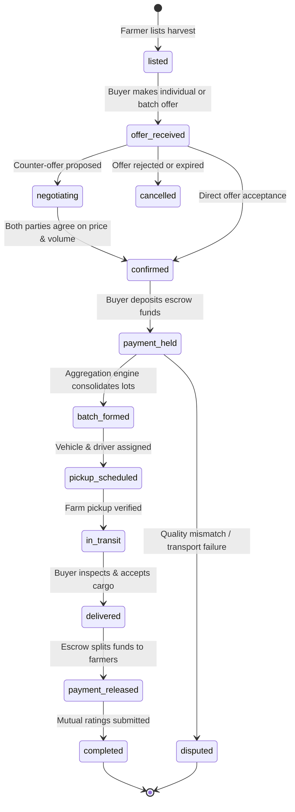

# KisanSetu System Architecture

This document details the architectural principles, component topology, state transitions, security model, and fail-safe designs underpinning the KisanSetu platform.

---

## 1. High-Level Architectural Topology

KisanSetu is structured as a decoupled, multi-tier distributed platform optimized for low latency, fault tolerance, and computational scalability.

```mermaid
graph TD
    subgraph Client ["Client Presentation Tier (Vite / React 18 PWA)"]
        UI["React UI (Farmer / Buyer / Admin)"]
        SW["Service Worker (Workbox App Shell Cache)"]
        Offline["Offline Fallback & Sync Queue"]
    end

    subgraph Gateway ["Application Gateway & API Tier (Node.js / Express / TypeScript)"]
        AuthMiddleware["JWT Authentication & RBAC Guard"]
        RouteHandlers["Express API Routes (/api/*)"]
        DomainServices["Domain Services (Order, Listing, Aggregation, Payment)"]
        AlgoCore["Core Pure Algorithms (Aggregation, Pricing, Forecast Fallback)"]
    end

    subgraph Analytics ["Intelligent Analytics Tier (Python 3 / Flask)"]
        MLService["Flask HTTP Microservice (:8000)"]
        RFEngine["Random Forest Inference Engine"]
        FeaturePipe["Lag / Rolling Feature Transformers"]
    end

    subgraph DataTier ["Data & Persistence Tier (PostgreSQL 16)"]
        RelationalDB[("PostgreSQL Database (23 Tables)")]
        AuditStore[("Append-Only Audit & SMS Logs")]
    end

    subgraph External ["External Integration Tier"]
        Fast2SMS["Fast2SMS / Twilio Gateway"]
        MandiGov["AGMARKNET / Data.gov.in API"]
    end

    UI <-->|HTTPS / REST API| AuthMiddleware
    SW -.->|Cache-First UI Assets| UI
    AuthMiddleware --> RouteHandlers
    RouteHandlers --> DomainServices
    DomainServices --> AlgoCore
    DomainServices -->|pg Pool Query| RelationalDB
    DomainServices -->|Audit Logging| AuditStore
    DomainServices <-->|HTTP /predict (2.5s timeout)| MLService
    MLService --> RFEngine
    RFEngine --> FeaturePipe
    DomainServices -.->|Optional Gov Mandi Sync| MandiGov
    DomainServices -.->|SMS Dispatch| Fast2SMS
```

---

## 2. Component Breakdown

### 2.1. Client Presentation Tier (`client/`)
- **Technology Stack**: React 18, Vite 5, Tailwind CSS, Radix UI primitives, Lucide React icons, Recharts for visual intelligence, i18next for localization.
- **PWA Capabilities**: `vite-plugin-pwa` registers a custom Service Worker precaching essential app-shell chunks (`.js`, `.css`, fonts, SVGs).
- **Graceful Offline Mode**: `public/offline.html` is displayed if a network disconnection occurs on non-cached routes. Financial transactions (order confirmation, escrow release) explicitly require live connectivity to prevent state inconsistency.

### 2.2. API & Application Tier (`server/`)
- **Technology Stack**: Node.js, Express, TypeScript 5.5, `pg` connection pool, `zod` schema validation, `bcryptjs` password hashing, `jsonwebtoken`.
- **Pure Algorithm Isolation**: All core mathematical and clustering algorithms (`aggregation.algorithm.ts`, `pricing.algorithm.ts`, `forecast.algorithm.ts`) are completely pure and decoupled from database or network I/O, allowing deterministic execution and sub-millisecond unit test coverage.
- **Repository Pattern**: Relational queries are encapsulated within dedicated repository classes (`listing.repository.ts`, `order.repository.ts`, `price.repository.ts`, etc.) maintaining strong typing between SQL snake_case tuples and TypeScript camelCase DTOs.

### 2.3. Intelligent Analytics Microservice (`ml/`)
- **Technology Stack**: Python 3.13, Flask, scikit-learn 1.5.2, pandas 2.2.3, numpy 2.1.0, joblib.
- **Predictive Role**: Evaluates regional historical supply/demand series, computing multi-step recursive forecasts with confidence intervals and demand growth velocity.
- **Circuit Breaker Design**: The Express server implements a strict 2,500ms timeout with an `AbortController`. If the Python ML microservice is unreachable or times out, the backend gracefully cascades to `forecastFromHistory()` (a pure TypeScript linear regression and variance band fallback), ensuring 100% platform uptime.

### 2.4. Persistence & Audit Layer (`server/src/db/`)
- **Engine**: PostgreSQL 16 on standard port 5432.
- **Data Integrity**: 23 normalized tables enforcing foreign key constraints, `ON DELETE CASCADE` where appropriate, strict `CHECK` constraints on enums and numeric boundaries ($Q > 0, P > 0, 1 \le \text{rating} \le 5$).
- **Audit Trails**: Every financial and status transition is recorded synchronously in `audit_logs` with actor ID, timestamp, and JSON metadata.

---

## 3. The 12-Stage Order Lifecycle State Machine

Orders progress through a strictly guarded finite state machine to guarantee that all parties (farmers, buyers, transport drivers, platform admin) execute commitments sequentially.



### State Guard Invariants
1. **Escrow Guarantee**: An order cannot transition to `pickup_scheduled` or `batch_formed` without an active `payment_held` escrow record.
2. **Delivery Verification**: Payment cannot transition from `held` to `released` without prior verification of `delivered` status or buyer release confirmation.
3. **Paisa Allocation Parity**: The sum of all individual `payment_allocations` distributed to contributing farmers must equal the order `total_amount` down to the exact paisa ($0.01$).

---

## 4. Security & Access Model

### Role-Based Access Control (RBAC)
KisanSetu classifies users into three mutually exclusive security personas:
- **`farmer`**: Can create and update listings, inspect personalized regional demand forecasts, accept/counter buyer offers, schedule farm pickups, and track bank payouts. Restricted from viewing buyer spend analytics or admin audits.
- **`buyer`**: Can search nationwide produce listings, execute the Smart Aggregation Engine, issue offers, deposit demo escrow payments, schedule logistics vehicles, verify deliveries, and release funds.
- **`admin`**: Full platform oversight with exclusive access to Gross Merchandise Value (GMV) aggregation, dispute arbitration, SMS dispatch logs, and append-only audit records.

### Authentication & Token Security
- Passwords are salted and hashed using `bcryptjs` with a cost factor of 10.
- Sessions use signed JSON Web Tokens (`HS256`) carrying `userId`, `email`, and `role` with an 8-hour expiration.
- Express middleware verifies the `Authorization: Bearer <token>` header on all protected routes and rejects unauthorized role escalations with HTTP 403 Forbidden.

---

## 5. Reliability & Fallback Strategies

| Layer | Potential Failure Point | Fallback Mechanism |
|---|---|---|
| **Forecasting** | Python Flask microservice offline or crashed | Express API catches network exception, invokes `forecastFromHistory()` (linear-trend + variance model), logs alert, and sets `methodology: "internal_fallback"`. |
| **Mandi Prices** | Government AGMARKNET API down or rate-limited | `GovernmentPriceProvider` falls through to `SeededPriceProvider` reading from PostgreSQL `mandi_prices` snapshot table. |
| **SMS Gateway** | Fast2SMS / Twilio credit exhaustion or API downtime | Provider cascades to `MockSMSProvider`, recording delivery payloads to `sms_logs` table without blocking transactions. |
| **Connectivity** | Rural farmer in 2G/no-data coverage zone | Platform dispatches transactional SMS alerts containing crucial order, pickup, and payment details to the farmer's registered mobile number. |
