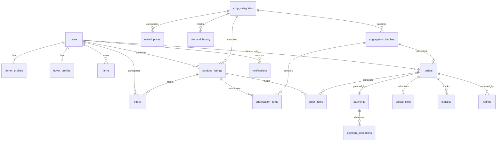

# Relational Database Schema & Data Model

> **PostgreSQL 16 Schema Specification**  
> *23 Normalized Tables Supporting ACID Transactions, Spatial Geometry, and Audit Trails*

---

## 1. Schema Design Philosophy

KisanSetu's database tier is built on PostgreSQL 16 with zero proprietary extensions required (utilizing the native `gen_random_uuid()` core function).

The data model prioritizes:
1. **Strict Financial Auditability**: Escrow accounts and multi-farmer payment distributions maintain strict foreign key integrity and check constraints.
2. **Relational Normalization**: Distinct tables isolate user credentials, operational roles, physical harvest lots, and aggregated trade batches.
3. **High-Performance Query Indexing**: B-tree composite indices target geospatial lookups, crop-region queries, and chronological audit scans.

---

## 2. Entity-Relationship Diagram (ERD)

---

## 3. Relational Table Specifications

### 3.1. Identity & Profile Tables

#### `users`
Core user identity storing authentication credentials, role personas, and default regional coordinates.
- `id`: `UUID PRIMARY KEY DEFAULT gen_random_uuid()`
- `name`: `TEXT NOT NULL`
- `email`: `TEXT NOT NULL UNIQUE`
- `phone`: `TEXT NOT NULL UNIQUE`
- `password_hash`: `TEXT NOT NULL` (Bcrypt)
- `role`: `TEXT NOT NULL CHECK (role IN ('farmer', 'buyer', 'admin'))`
- `buyer_type`: `TEXT CHECK (buyer_type IN ('retailer', 'restaurant', 'hostel', 'kirana', 'fpo', 'consumer'))`
- `region`: `TEXT` (Primary agricultural district)
- `village`: `TEXT`
- `latitude`, `longitude`: `NUMERIC(9,6)`
- `language_preference`: `TEXT DEFAULT 'en' CHECK (language_preference IN ('en', 'hi', 'mr'))`
- `low_connectivity_mode`: `BOOLEAN DEFAULT FALSE`
- `is_verified`: `BOOLEAN DEFAULT FALSE`
- `created_at`, `updated_at`: `TIMESTAMPTZ`

#### `farmer_profiles`
Operational metrics and cumulative earnings for farmers.
- `id`: `UUID PRIMARY KEY DEFAULT gen_random_uuid()`
- `user_id`: `UUID NOT NULL UNIQUE REFERENCES users(id) ON DELETE CASCADE`
- `avg_rating`: `NUMERIC(3,2) DEFAULT 0`
- `total_ratings`: `INT DEFAULT 0`
- `total_orders`: `INT DEFAULT 0`
- `total_earnings`: `NUMERIC(12,2) DEFAULT 0`
- `verified_farmer`: `BOOLEAN DEFAULT FALSE`

#### `buyer_profiles`
Commercial procurement statistics and business identities for buyers.
- `id`: `UUID PRIMARY KEY DEFAULT gen_random_uuid()`
- `user_id`: `UUID NOT NULL UNIQUE REFERENCES users(id) ON DELETE CASCADE`
- `business_name`: `TEXT`
- `avg_rating`: `NUMERIC(3,2) DEFAULT 0`
- `total_spend`: `NUMERIC(12,2) DEFAULT 0`

#### `farms`
Land parcel records associated with individual farmers.
- `id`: `UUID PRIMARY KEY DEFAULT gen_random_uuid()`
- `farmer_id`: `UUID NOT NULL REFERENCES users(id) ON DELETE CASCADE`
- `name`: `TEXT NOT NULL`
- `region`: `TEXT NOT NULL`, `village`: `TEXT`
- `latitude`, `longitude`: `NUMERIC(9,6)`
- `size_acres`: `NUMERIC(6,2)`

---

### 3.2. Marketplace & Commodities

#### `crop_categories`
Reference catalog of standardized crops.
- `code`: `TEXT NOT NULL UNIQUE` (`tomato`, `onion`, `potato`, `grapes`, `pomegranate`, `wheat`)
- `name`: `TEXT NOT NULL`
- `unit`: `TEXT NOT NULL DEFAULT 'kg'`

#### `produce_listings`
Active harvest inventory published by farmers.
- `id`: `UUID PRIMARY KEY DEFAULT gen_random_uuid()`
- `farmer_id`: `UUID NOT NULL REFERENCES users(id) ON DELETE CASCADE`
- `crop_code`: `TEXT NOT NULL REFERENCES crop_categories(code)`
- `variety`: `TEXT`
- `quantity_kg`: `NUMERIC(10,2) CHECK (quantity_kg > 0)`
- `remaining_quantity_kg`: `NUMERIC(10,2) CHECK (remaining_quantity_kg >= 0)`
- `expected_price_per_kg`: `NUMERIC(8,2) CHECK (expected_price_per_kg > 0)`
- `harvest_date`: `DATE NOT NULL`
- `quality`: `TEXT NOT NULL CHECK (quality IN ('A', 'B', 'C'))`
- `region`: `TEXT NOT NULL`, `village`: `TEXT`
- `latitude`, `longitude`: `NUMERIC(9,6)`
- `status`: `TEXT NOT NULL DEFAULT 'active' CHECK (status IN ('active', 'reserved', 'aggregated', 'sold', 'expired', 'withdrawn'))`

---

### 3.3. Market Intelligence & Forecasts

#### `mandi_prices`
Real-time spot price snapshots across regional APMCs.
- `crop_code`: `TEXT NOT NULL REFERENCES crop_categories(code)`
- `region`: `TEXT NOT NULL`
- `mandi_name`: `TEXT NOT NULL`
- `price_per_kg`: `NUMERIC(8,2) NOT NULL`
- `previous_price_per_kg`: `NUMERIC(8,2) NOT NULL`
- `source`: `TEXT NOT NULL DEFAULT 'seeded' CHECK (source IN ('government', 'seeded'))`
- `UNIQUE (crop_code, region, mandi_name)`

#### `price_history` & `demand_history`
Daily continuous time series spanning 150 historical days.
- `recorded_date`: `DATE NOT NULL`
- `demand_kg`: `NUMERIC(10,2) NOT NULL`
- `price_per_kg`: `NUMERIC(8,2) NOT NULL`

#### `demand_forecasts`
Cached Machine Learning predictions generated by the Random Forest model.
- `horizon_days`: `INT NOT NULL` (7, 14, 30)
- `expected_demand_kg`, `lower_bound_kg`, `upper_bound_kg`: `NUMERIC(10,2)`
- `confidence`: `NUMERIC(4,3)`
- `trend`: `TEXT CHECK (trend IN ('rising', 'falling', 'stable'))`
- `methodology`: `TEXT CHECK (methodology IN ('internal_fallback', 'ml_service'))`

---

### 3.4. Negotiations, Batches & Orders

#### `offers`
Bilateral price and quantity quotes between buyers and individual farmers.
- `listing_id`: `UUID REFERENCES produce_listings(id) ON DELETE CASCADE`
- `offered_price_per_kg`: `NUMERIC(8,2)`
- `quantity_kg`: `NUMERIC(10,2)`
- `status`: `TEXT DEFAULT 'pending' CHECK (status IN ('pending', 'countered', 'accepted', 'rejected', 'expired'))`
- `history`: `JSONB DEFAULT '[]'` (Chronological audit of counter-offers)

#### `aggregation_batches`
Bulk consignments consolidated by the Smart Aggregation Engine.
- `batch_code`: `TEXT NOT NULL UNIQUE` (`BATCH-YYYYMMDD-XXXX`)
- `crop_code`: `TEXT REFERENCES crop_categories(code)`
- `requested_quantity_kg`, `fulfilled_quantity_kg`: `NUMERIC(10,2)`
- `weighted_price_per_kg`: `NUMERIC(8,2)`
- `estimated_total`: `NUMERIC(12,2)`
- `status`: `TEXT DEFAULT 'forming' CHECK (status IN ('forming', 'confirmed', 'pickup_scheduled', 'in_transit', 'delivered', 'settled', 'cancelled'))`

#### `orders`
Legally binding trade contracts governing single-farmer or aggregated batches.
- `order_code`: `TEXT NOT NULL UNIQUE` (`ORD-YYYYMMDD-XXXX`)
- `buyer_id`: `UUID REFERENCES users(id)`
- `total_quantity_kg`, `agreed_price_per_kg`, `total_amount`: `NUMERIC`
- `status`: 12-state enum (`listed` through `completed`)
- `aggregation_batch_id`: `UUID REFERENCES aggregation_batches(id)`

#### `order_items` & `aggregation_items`
Per-farmer line items recording volume, price, subtotal, and transit distance.

---

### 3.5. Payments, Escrow & Logistics

#### `payments`
Demo escrow custody locking buyer funds until delivery fulfillment.
- `order_id`: `UUID NOT NULL UNIQUE REFERENCES orders(id) ON DELETE CASCADE`
- `amount`: `NUMERIC(12,2) NOT NULL`
- `status`: `TEXT DEFAULT 'pending' CHECK (status IN ('pending', 'held', 'released', 'refunded', 'failed'))`
- `provider`: `TEXT DEFAULT 'demo_escrow'`
- `held_at`, `released_at`: `TIMESTAMPTZ`

#### `payment_allocations`
Exact-to-the-paisa payout distribution splitting escrow funds among contributing farmers.
- `payment_id`: `UUID NOT NULL REFERENCES payments(id) ON DELETE CASCADE`
- `farmer_id`: `UUID NOT NULL REFERENCES users(id)`
- `quantity_kg`: `NUMERIC(10,2)`
- `amount`: `NUMERIC(12,2)`

#### `pickup_slots` & `logistics`
Transport vehicle, driver assignment, and physical checkpoint events.

#### `ratings`
Two-way trust score submitted upon order completion (quality, reliability, communication, timeliness; $1\text{--}5$).

---

### 3.6. Communication & System Logs

#### `sms_logs`
Comprehensive ledger of every SMS dispatched by mock, Fast2SMS, or Twilio providers.

#### `audit_logs`
Tamper-evident chronological records of administrative and security events.

---

## 4. Indexing Strategy

| Index Name | Target Table | Indexed Columns | Performance Objective |
|---|---|---|---|
| `idx_listings_crop_region_status` | `produce_listings` | `(crop_code, region, status)` | Powers sub-millisecond aggregation candidate scans |
| `idx_orders_status` | `orders` | `(status)` | Accelerates order state machine dashboards |
| `idx_mandi_prices_crop_region` | `mandi_prices` | `(crop_code, region)` | Real-time fair price lookups during listing creation |
| `idx_price_history_lookup` | `price_history` | `(crop_code, region, recorded_date)` | Accelerates 30-day moving average computation |
| `idx_demand_history_lookup` | `demand_history` | `(crop_code, region, recorded_date)` | Feeds ML feature engineering pipeline |
| `idx_sms_logs_created` | `sms_logs` | `(created_at DESC)` | Powers real-time admin SMS audit center |
| `idx_audit_created` | `audit_logs` | `(created_at DESC)` | Compliance log inspection |
