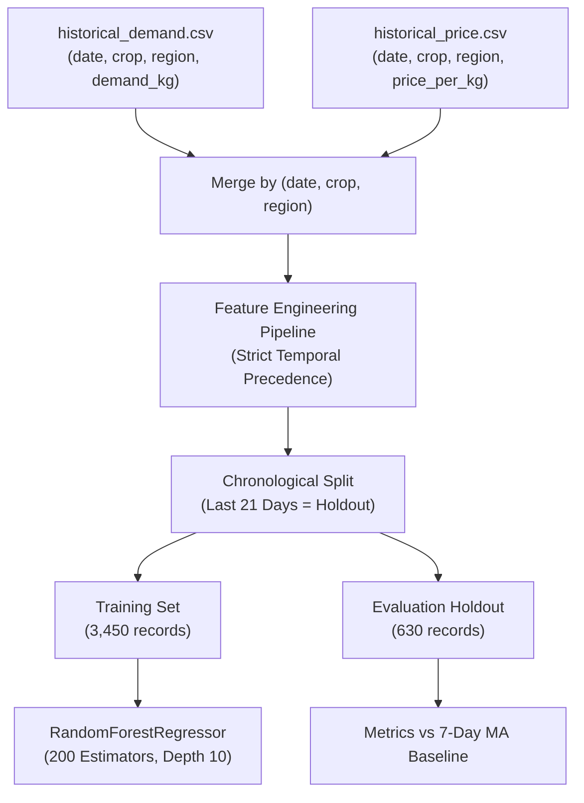

# Demand Forecasting Intelligence

> **Predictive Advisory Engine**  
> *Preventing Post-Harvest Gluts and Distress Sales with Machine Learning*

---

## 1. Problem Statement & Motivation

Indian agriculture suffers from chronic **cobweb cycles**:
1. When a commodity (e.g., onion or tomato) reaches record prices in Month 1, hundreds of thousands of farmers simultaneously sow that crop.
2. At harvest time 90–120 days later, a massive supply glut hits regional APMC mandis simultaneously.
3. Market prices collapse below cultivation and transport costs, compelling farmers to dump produce on highways.

KisanSetu addresses this structural inefficiency through **Advisory Demand Forecasting**: providing smallholders with clear, localized demand projections and supply gap indicators *before* they harvest and transport their produce.

> **Ethical Product Principle**: KisanSetu's forecasts are explicitly framed as *advisory market intelligence*, not unconditional financial guarantees. System recommendations read:  
> *"Demand for Tomato is expected to rise 14%. Current listed supply is approximately 1,250 kg below expected demand..."*

---

## 2. Dataset Architecture

The forecasting system models 30 distinct geographic-commodity corridors:
- **Crops (6)**: Tomato, Onion, Potato, Grapes, Pomegranate, Wheat.
- **Key Agrarian Regions (5)**: Nashik, Pune, Satara, Sangli, Ahmednagar.
- **Historical Volume**: 4,500 daily transactional records (150 contiguous days per corridor).



---

## 3. Feature Engineering Pipeline

To prevent **temporal data leakage** (the catastrophic flaw where future observations leak into historical features), all features are calculated strictly from observations preceding target date $t$.

The feature vector $\mathbf{x}_t \in \mathbb{R}^{27}$ comprises:

### 3.1. Temporal & Calendar Signals
- `day_of_week`: Integer $0\text{--}6$ (Monday to Sunday) capturing wholesale auction cycles.
- `month`: Integer $1\text{--}12$ capturing macro-seasonal demand.
- `is_weekend`: Binary flag ($1$ for Friday through Sunday, peak institutional procurement days).
- `season_*`: One-hot encoded seasonal indicators (`winter`, `summer`, `monsoon`, `post_monsoon`).

### 3.2. Autoregressive Lag Features
- `lag_1`: Demand recorded at $t - 1$ day ($\text{Demand}_{t-1}$).
- `lag_7`: Demand recorded at $t - 7$ days ($\text{Demand}_{t-7}$, capturing weekly seasonality).

### 3.3. Rolling Window Aggregations
- `moving_avg_7`: Rolling 7-day average of demand prior to date $t$:
  $$\mu_{7, t} = \frac{1}{7} \sum_{i=1}^7 \text{Demand}_{t-i}$$
- `moving_avg_14`: Rolling 14-day average of demand prior to date $t$:
  $$\mu_{14, t} = \frac{1}{14} \sum_{i=1}^{14} \text{Demand}_{t-i}$$
- `demand_growth_7d`: Week-over-week velocity of demand expansion:
  $$g_{7, t} = \frac{\text{lag}_1 - \text{lag}_7}{\text{lag}_7}$$

### 3.4. Price-Demand Elasticity Signals
- `price_per_kg`: Mandi spot price at $t-1$.
- `price_change_7d`: 7-day price percentage shift:
  $$\Delta P_{7, t} = \frac{P_{t-1} - P_{t-8}}{P_{t-8}}$$

### 3.5. Categorical Encodings
- One-hot binary vectors for all 6 crops (`crop_tomato`, `crop_onion`, ...) and 5 regions (`region_nashik`, `region_pune`, ...).

---

## 4. Model Architecture & Evaluation Discipline

### Model Configuration
- **Algorithm**: `RandomForestRegressor` (`scikit-learn` 1.5.2)
- **Hyperparameters**:
  - `n_estimators`: 200 trees
  - `max_depth`: 10 levels (prevents overfitting to idiosyncratic daily noise)
  - `min_samples_leaf`: 3 samples
  - `random_state`: 42

### Rigorous Chronological Holdout
Standard random $k$-fold cross-validation is invalid for time series because it samples randomly across time, leaking future data points into past predictions. KisanSetu enforces a strict **21-day chronological holdout** across all 30 series:
- **Training Records**: 3,450 rows
- **Holdout Test Records**: 630 rows (the final 21 days of each series)

### Benchmark Against Naive Baseline
To demonstrate genuine predictive utility rather than inflated claims, the Random Forest model was benchmarked directly against a standard **7-Day Moving Average Baseline** ($\hat{y}_t = \mu_{7, t}$):

$$\text{MAE} = \frac{1}{N} \sum_{i=1}^N |y_i - \hat{y}_i| \qquad \text{RMSE} = \sqrt{\frac{1}{N} \sum_{i=1}^N (y_i - \hat{y}_i)^2} \qquad \text{MAPE} = \frac{1}{N} \sum_{i=1}^N \left|\frac{y_i - \hat{y}_i}{y_i}\right| \times 100\%$$

| Metric | Naive 7-Day Moving Average Baseline | KisanSetu Random Forest Regressor | Improvement |
|---|---|---|---|
| **MAE** | $9.52\text{ kg}$ | **$6.64\text{ kg}$** | **$+30.3\%$ Error Reduction** |
| **RMSE** | $13.76\text{ kg}$ | **$9.42\text{ kg}$** | **$+31.5\%$ Error Reduction** |
| **MAPE** | $5.04\%$ | **$3.63\%$** | **$+28.0\%$ Precision Boost** |

### Top Feature Importances
1. **`lag_7`** ($69.96\%$): Weekly periodicity is the single dominant predictive driver in institutional procurement.
2. **`moving_avg_7`** ($25.12\%$): Baseline short-term volume level.
3. **`lag_1`** ($3.53\%$): Immediate prior-day inertia.
4. **`moving_avg_14`** ($0.97\%$): Bi-weekly trajectory.
5. **`day_of_week`** ($0.08\%$): Intraworld weekend surges.

---

## 5. Multi-Step Recursive Inference

When a farmer or buyer queries a 7, 14, or 30-day forecast:
1. The microservice loads the latest 30 days of historical observations for the requested crop and region.
2. It computes features for day $t+1$ and predicts $\hat{y}_{t+1}$.
3. For multi-step predictions ($t+2, \dots, t+H$), predicted values recursively populate the lag and moving average buffers:
   $$\text{lag}_1^{(t+2)} = \hat{y}_{t+1}, \quad \mu_7^{(t+2)} = \frac{1}{7}\left( \hat{y}_{t+1} + \sum_{i=1}^6 y_{t-i+1} \right)$$
4. Prediction intervals (confidence bands) expand with the horizon:
   $$\text{Band}_h = \hat{y}_h \pm z \cdot \text{RMSE} \cdot \sqrt{1 + \frac{h}{H}}$$

---

## 6. Circuit Breaker & Resilient Fallback

In production environments, ML microservices may face latency spikes or resource starvation. KisanSetu guarantees uninterrupted frontend availability via an automatic fallback:

```typescript
// server/src/services/forecast.service.ts
const controller = new AbortController();
const timeout = setTimeout(() => controller.abort(), 2500);

try {
  const res = await fetch(`${env.ML_SERVICE_URL}/predict`, { ... });
  // Process ML Service Response (methodology: "ml_service")
} catch {
  // Cascades immediately to pure TypeScript forecastFromHistory()
  // methodology: "internal_fallback"
}
```

When operating in fallback mode:
- The backend executes `forecastFromHistory()`, a linear-trend regression with variance bands computed directly in Node.js.
- The UI displays an honest badge indicator showing `"internal_fallback"` so evaluators and users know which engine serviced the request.
