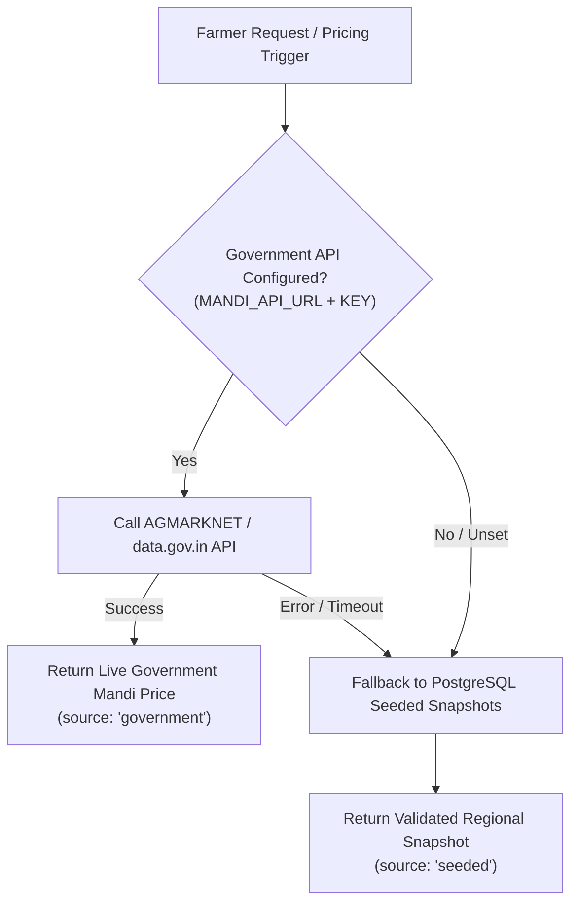

# Fair-Price Intelligence Engine

> **Transparent Pricing Corridors for Indian Agriculture**  
> *Eliminating Information Asymmetry between Farmers and Traders*

---

## 1. Agricultural Pricing Realities

In regional Agricultural Produce Market Committee (APMC) mandis across India, spot prices fluctuate by up to $40\%$ within a single 48-hour window due to local truck arrival volumes, trader cartels, and unseasonal weather.

Smallholder farmers encounter two dangerous extremes when listing harvest prices:
- **Overpricing**: Pricing above market clearing levels results in zero inquiries, leading to crop rot in the field.
- **Underpricing**: Pricing too low hands massive arbitrage profits to intermediaries and erodes farmer livelihood.

Instead of predicting an unrealistic single-point price, **KisanSetu computes a Dynamic Fair-Price Corridor** $[P_{\min}, P_{\max}]$, providing farmers with an evidence-backed negotiation bandwidth.

---

## 2. Multi-Tier Mandi Price Providers

KisanSetu abstracts mandi data acquisition behind the `IMandiPriceProvider` interface (`server/src/services/price.service.ts`):

```typescript
export interface IMandiPriceProvider {
  readonly name: "government" | "seeded";
  getCurrentPrice(crop: CropCategory, region: string): Promise<MandiPrice | null>;
}
```



### Zero-Crash Guarantee
Every price payload returned to the frontend explicitly contains a `source` tag (`"government"` or `"seeded"`). Judges and users can immediately inspect the data provenance without the application ever crashing due to missing external credentials.

---

## 3. The Fair-Price Corridor Algorithm

Implemented in pure TypeScript in `server/src/services/algorithms/pricing.algorithm.ts`, the corridor calculation evaluates 5 input variables:

$$\mathbf{Input} = \left( P_{\text{mandi}}, \; P_{\text{nearby}}, \; P_{30\text{d}}, \; g_{\text{demand}}, \; \text{Grade} \right)$$

### Step 1: Blended Baseline Price ($P_{\text{blended}}$)
To insulate farmers from single-day price anomalies or local cartel suppression, the baseline price blends spot prices with regional and monthly anchors:

$$P_{\text{blended}} = 0.50 \cdot P_{\text{mandi}} + 0.30 \cdot P_{\text{nearby}} + 0.20 \cdot P_{30\text{d}}$$

| Component | Weight | Rationale |
|---|---|---|
| **$P_{\text{mandi}}$ (Spot Price)** | $50\%$ | Reflects current liquidity and immediate terminal market supply. |
| **$P_{\text{nearby}}$ (District Mandis)** | $30\%$ | Counteracts localized cartel manipulation within a single mandi. |
| **$P_{30\text{d}}$ (30-Day Moving Average)** | $20\%$ | Dampens high-frequency speculative volatility. |

---

### Step 2: Quality Grade Adjustment ($M_{\text{quality}}$)
Produce is graded by physical inspection standards (size, color, firmness, blemish ratio):

| Quality Grade | Multiplier ($M_{\text{quality}}$) | Value Impact |
|---|---|---|
| **Grade A** (Export & Premium Retail) | **$1.04$** | $+4\%$ premium over baseline |
| **Grade B** (Standard Commercial Mandi) | **$1.00$** | Benchmark baseline parity |
| **Grade C** (Processing & Bulk Pulp) | **$0.94$** | $-6\%$ discount |

---

### Step 3: Demand Momentum Adjustment ($M_{\text{demand}}$)
The engine integrates the 7-day demand growth velocity ($g_{\text{demand}}$) generated by the Machine Learning forecasting service:

$$\text{Demand Level} = \begin{cases} 
\text{High} & \text{if } g_{\text{demand}} \ge +12\% \\
\text{Low} & \text{if } g_{\text{demand}} \le -8\% \\
\text{Moderate} & \text{otherwise}
\end{cases}$$

$$M_{\text{demand}} = \begin{cases}
1.06 & \text{for High Demand } (+6\% \text{ scarcity premium}) \\
1.00 & \text{for Moderate Demand} \\
0.96 & \text{for Low Demand } (-4\% \text{ liquidity discount})
\end{cases}$$

---

### Step 4: Quality & Demand Adjusted Price ($P_{\text{adj}}$)

$$P_{\text{adj}} = P_{\text{blended}} \times M_{\text{quality}} \times M_{\text{demand}}$$

---

### Step 5: Suggested Corridor $[P_{\min}, P_{\max}]$

The final dynamic negotiation corridor is established around $P_{\text{adj}}$:

$$P_{\min} = \text{round}_2(P_{\text{adj}} \times 0.96) \quad (-4\% \text{ support floor})$$
$$P_{\max} = \text{round}_2(P_{\text{adj}} \times 1.06) \quad (+6\% \text{ upside ceiling})$$

---

## 4. Worked Calculation Example

### Scenario
A farmer in Nashik lists **Grade A Onions**:
- Today's Nashik Mandi spot price ($P_{\text{mandi}}$): ₹$24.00$/kg
- Nearby Lasalgaon/Pimpalgaon average ($P_{\text{nearby}}$): ₹$25.50$/kg
- 30-day moving average ($P_{30\text{d}}$): ₹$22.00$/kg
- Demand Growth forecast ($g_{\text{demand}}$): $+15.2\%$ (classified as **High Demand**)
- Quality: **Grade A**

### Computation Steps
1. **Blended Baseline**:
   $$P_{\text{blended}} = (24.00 \times 0.5) + (25.50 \times 0.3) + (22.00 \times 0.2) = 12.00 + 7.65 + 4.40 = ₹24.05\text{/kg}$$
2. **Quality Multiplier**:
   $$M_{\text{quality}} = 1.04$$
3. **Demand Multiplier**:
   $$g_{\text{demand}} = +15.2\% \ge 12\% \implies M_{\text{demand}} = 1.06$$
4. **Adjusted Benchmark**:
   $$P_{\text{adj}} = 24.05 \times 1.04 \times 1.06 = 24.05 \times 1.1024 \approx ₹26.51\text{/kg}$$
5. **Corridor Derivation**:
   $$P_{\min} = 26.51 \times 0.96 \approx \mathbf{₹25.45\text{/kg}}$$
   $$P_{\max} = 26.51 \times 1.06 \approx \mathbf{₹28.10\text{/kg}}$$

### Actionable Farmer Recommendation Displayed in UI
> *"Demand is currently strong. Market conditions support a competitive price near ₹28/kg."*

---

## 5. UI Integration & Advisory Framing

The fair-price corridor updates dynamically on the farmer's listing form whenever the crop, region, or quality grade is changed. By visualizing this corridor directly beside the buyer offer panel, farmers can instantly determine whether an offer is fair, opportunistic, or exploitative.
