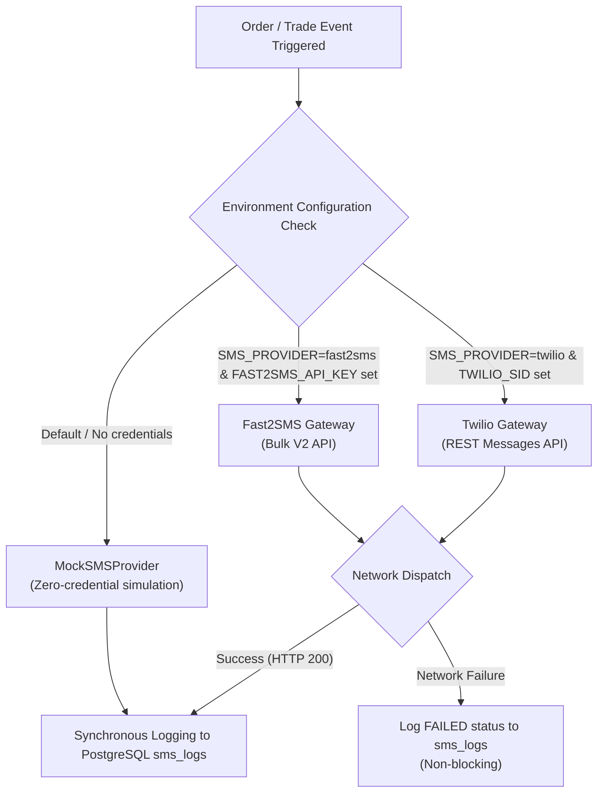

# Low-Connectivity SMS Notification Architecture

> **Bridging the Digital Divide in Rural India**  
> *Real-Time Transactional Alerts for Feature Phones & 2G Edge Networks*

---

## 1. The Rural Connectivity Challenge

While smartphone adoption is growing across agricultural belts in India, millions of smallholder farmers operate under severe digital constraints:
- **Feature Phone Dominance**: A significant fraction of marginal farmers use basic GSM feature phones without web browsers or mobile apps.
- **Intermittent 4G Data**: Connectivity in remote fields frequently drops to 2G or zero signal during monsoon storms and power outages.
- **Urgency of Trade Actions**: Produce is perishable. If an institutional buyer confirms a batch or schedules a transport pickup, a farmer cannot wait until they return home to check a web dashboard.

**KisanSetu's SMS Notification Pipeline** ensures that every critical milestone in the trade lifecycle is pushed synchronously to the farmer's feature phone via standard SMS.

---

## 2. Multi-Provider Architecture

The notification engine implements the `ISMSProvider` interface in `server/src/services/sms.service.ts`:

```typescript
export interface SendSmsInput {
  toPhone: string;
  toName?: string;
  toUserId?: string;
  event: SmsEvent;
  message: string;
}

export interface ISMSProvider {
  readonly name: "mock" | "fast2sms" | "twilio";
  send(input: SendSmsInput): Promise<{ status: SmsStatus }>;
}
```



### Provider Selection Logic
At startup, `selectProvider()` evaluates available environment variables:
1. **`Fast2SMSProvider`**: Designed specifically for Indian DLT/GSM gateways via `https://www.fast2sms.com/dev/bulkV2`.
2. **`TwilioProvider`**: International fallback supporting E.164 phone numbering.
3. **`MockSMSProvider` (Default)**: Automatically chosen if no external credentials exist. Simulates instant delivery (`status: DELIVERED`) and writes to the audit database. **This guarantees that hackathon judges and evaluators experience 100% functional SMS flows with zero setup friction.**

---

## 3. Transactional Event Triggers

SMS alerts are dispatched at 7 critical state changes:

| Event Code | Trigger Point | SMS Message Template | Recipient |
|---|---|---|---|
| `LISTING_CREATED` | Farmer publishes harvest lot | `KisanSetu: Your listing for {qty}kg {crop} is live at ₹{price}/kg. We will notify you when buyers make offers.` | Farmer |
| `OFFER_RECEIVED` | Buyer submits formal price quote | `KisanSetu: Buyer {buyerName} made an offer of ₹{price}/kg for {qty}kg {crop}. Log in to review or counter.` | Farmer |
| `OFFER_COUNTERED` | Farmer proposes counter-price | `KisanSetu: Farmer {farmerName} countered with ₹{price}/kg for {qty}kg {crop}. Review in your orders dashboard.` | Buyer |
| `BATCH_INCLUDED` | Aggregation Engine consolidates batch | `KisanSetu: Great news! Your {qty}kg {crop} has been included in Bulk Batch #{batchCode}. Prepare harvest.` | Farmer |
| `PICKUP_SCHEDULED` | Logistics truck assigned | `KisanSetu: Pickup scheduled on {date} at {time}. Vehicle: {vehicleNumber}, Driver: {driverName}. Have cargo ready.` | Farmer |
| `ORDER_DELIVERED` | Cargo reaches destination hub | `KisanSetu: Order #{orderCode} delivered and verified at destination. Escrow release initiated.` | Both |
| `PAYMENT_RELEASED` | Escrow settlement disbursed | `KisanSetu: Escrow payment released! ₹{amount} has been credited for your {qty}kg {crop}. Thank you!` | Farmer |

---

## 4. Persistent Audit & Compliance Logging

Every SMS attempt (mock, external success, or gateway failure) is permanently recorded in the PostgreSQL `sms_logs` table:

```sql
CREATE TABLE IF NOT EXISTS sms_logs (
  id                  UUID PRIMARY KEY DEFAULT gen_random_uuid(),
  recipient_phone     TEXT NOT NULL,
  recipient_name      TEXT,
  recipient_user_id   UUID REFERENCES users(id),
  message             TEXT NOT NULL,
  event               TEXT NOT NULL,
  status              TEXT NOT NULL DEFAULT 'sent' CHECK (status IN ('sent', 'delivered', 'failed')),
  provider            TEXT NOT NULL DEFAULT 'mock' CHECK (provider IN ('mock', 'fast2sms', 'twilio')),
  created_at          TIMESTAMPTZ NOT NULL DEFAULT now()
);
```

### Administrative Verification Center
Platform administrators can review SMS traffic in real time at `/admin/dashboard`:
- Chronological inspection of all dispatched alerts.
- Filter by recipient phone number or event type.
- Verification of delivery latency and provider response codes.
